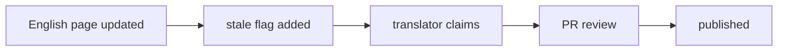

This page covers tone, code samples, heading levels, terminology, and diagram conventions. All public documents — reference, tutorial, and contributor guide — follow these rules.

## Tone and tense

- Use declarative sentences in the present tense.
- Avoid passive voice: write "specformula-dev-framework parses the feature file", not "the feature file is parsed by specformula-dev-framework".
- Avoid marketing adjectives: words like "powerful", "elegant", "seamless", and "easy" must be replaced with concrete facts.
- Do not use "we" or "you". Use explicit subjects: "specformula-dev-framework", "the user", "the contributor".
- Do not use exclamation marks. Do not use emoji (strictly prohibited in reference and spec documents; keep them out of tutorials as well).

## Code sample conventions

**Complete vs. snippet**: tutorials use complete, runnable examples that include the `Feature:` header. Reference and API docs may use snippets.

Every fenced block must declare a language (`gherkin` / `bash` / `mermaid`, etc.); the language marker drives syntax highlighting and is not shown on the rendered page. Source form (note the language marker on each opening fence):

````md
```gherkin
Scenario: set a relative time
  When time-control 設定時間為 "@time(now-1d)"
  Then time-control 現在時間的年月日為 2025-11-03
```

```bash
mvn test
```
````

Examples longer than 80 characters belong in a code block, not inline.

Use meaningful variable names: `$user_id` rather than `$x`; use realistic identifiers.

## Heading levels

- Each page has exactly one `#` (generated from the frontmatter `title`; do not add another `#` in the body).
- Do not skip levels: do not jump from `##` directly to `####`.
- English headings use sentence case. No restriction for Chinese headings.
- Do not number headings unless the page is an explicitly ordered step-by-step guide.

## Terminology consistency

All terms are defined in the [glossary](/docs/contributing/overview/glossary). Do not redefine terms in individual pages.

Do not alternate between synonyms — pick one term and use it throughout:

- "instruction", not alternating with "command" or "commande".
- "spec author", not alternating with "spec designer" or "spec writer".

Instruction names always appear in kebab-case with code formatting: `api-call`, `entity-setup`, `entity-validate`, `time-control` — never "api call" or "ApiCall".

## Diagrams

Prefer mermaid (built-in site support, version-controllable):



Use image files only for complex architecture diagrams that mermaid cannot express. Store them in `public/diagrams/`, using kebab-case filenames, e.g. `hierarchical-adr-flow.png`. Every image must have alt text and a caption.
