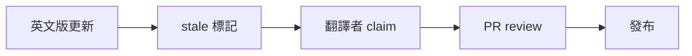

本頁說明文件的語氣、code sample、標題層級、術語使用，以及圖與 diagram 的規範。所有公開文件（reference、tutorial、貢獻者指南）都適用。

## 語氣與時態

- 陳述句、現在式為主。
- 避免被動語態：寫「specformula-dev-framework 解析 feature 檔」，不寫「feature 檔被 specformula-dev-framework 解析」。
- 不使用行銷詞彙：「強大」「優雅」「無縫」「易用」等形容詞一律以具體事實取代。
- 不用「我們」「您」：主詞用「specformula-dev-framework」「使用者」「貢獻者」等明確名詞。
- 不用感嘆號，不放 emoji（reference 與 spec 文件絕對不放；tutorial 也盡量避免）。

## Code sample 慣例

**完整可跑 vs 片段**：tutorial 使用含 `Feature:` header 的完整可跑範例；reference 與 API 文件可使用片段。

每個 fenced block 開頭都要標語言（`gherkin` / `bash` / `mermaid` 等）；語言標記決定語法高亮，渲染後不會顯示在畫面上。原始碼寫法（注意每段第一行的語言標記）：

````md
```gherkin
Scenario: 設定相對時間
  When time-control 設定時間為 "@time(now-1d)"
  Then time-control 現在時間的年月日為 2025-11-03
```

```bash
mvn test
```
````

超過 80 字元的範例改用 code block，不在行內展示複雜片段。

變數命名使用有意義的名稱：用 `$user_id` 而非 `$x`；使用真實感的識別子。

## 標題層級

- 一頁只有一個 `#`（由 frontmatter `title` 產生，正文不再另加 `#`）。
- 不跳級：`##` 之後不直接用 `####`。
- 英文標題用句子大小寫（Sentence case），中文無此限制。
- 不在標題加流水號，除非該頁面的內容本身是依序步驟。

## 術語一致性

所有術語以 [glossary](/docs/contributing/overview/glossary) 為準，不在頁面內自行重新定義。

禁止同義詞交替使用，選定一個說法後全文一致：

- 「指令」不交替用「命令」或「commande」。
- 「Spec Author」不交替用「規格作者」或「spec writer」。

指令名稱永遠使用 kebab-case 加程式碼字體：`api-call`、`entity-setup`、`entity-validate`、`time-control`，不寫「api call」或「ApiCall」。

## 圖與 diagram

優先使用 mermaid（網站內建支援，可版控）：



無法用 mermaid 表達的複雜架構圖才使用圖檔，存放於 `public/diagrams/`，檔名使用 kebab-case，例如 `hierarchical-adr-flow.png`。每張圖都必須提供 alt text 與 caption。
