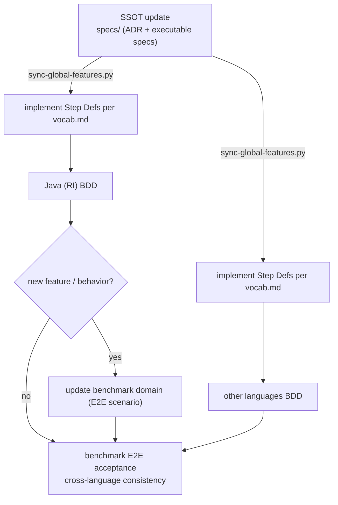

specformula-dev-framework is an **ISA framework** (Instruction Set Architecture): one language-neutral spec describes the instructions and symbol semantics of declarative BDD tests, so the same spec behaves consistently across multiple language implementations.

## How it works

The SSOT is updated and synced to each language; each language implements step defs and runs BDD, with final cross-language E2E acceptance on the benchmark:

**① SSOT update** — change `specs/` (ADR + `specs/features/` executable specs); `scripts/sync-global-features.py <lang>` + terminology mapping mirrors it into each language.

**② Implementation (same for RI and other languages)** — implement Step Defs from `vocab.md`, run BDD to green (framework-level conformance). Java is the Reference Implementation, implemented first to validate the spec.

**③ benchmark E2E acceptance** — benchmark is the project's **cross-language E2E acceptance scenario** (real domain + target service). For a new feature / behavior the RI updates the matching benchmark domain first; then the Java-For-All adapter drives each language's target service with the same domain spec, all passing the same acceptance → cross-language consistency. Details in [Benchmark](/docs/contributing/benchmark).

So before you start, separate: are you changing **spec-defined behavior** (change `specs/`) or **a language's implementation** (change that language)? When an implementation disagrees with the spec, the default is that the implementation has a bug; only when the spec itself is flawed or ambiguous do you go back and change the spec — no single language (including the Java RI) is automatically the standard.

## Module map

| Module | Role |
|---|---|
| `specs/adr/` | Global ADRs: cross-language spec and architecture decisions |
| `specs/features/` | Feature SSOT, vocab, terminology mapping |
| `specformula-java/` | Reference Implementation (RI) |
| `specformula-{csharp,python,ts}/` | Other language implementations; maturity / sync status may vary |
| `benchmark/` | Cross-implementation acceptance (domain + adapter); main variant tests `todo_list`, `ecommerce_platform` |
| `specformula-docs/` | Documentation site (you are reading it) |
| `specformula-lsp-plugin/` | LSP integration direction; not a primary contribution entry point |

## Pick what you are changing first

Decide the main purpose of this change, enter the matching guide, and read across layers later if needed. The core test: find who defines the contract.

<Cards>
  <Card title="Spec Author" href="/docs/contributing/spec-author">Define the cross-language contract: global ADRs, features, symbols, instructions, terminology. Works in `specs/`.</Card>
  <Card title="Implementer" href="/docs/contributing/implementer">Land an existing spec in a language, fix bugs, write project ADRs. Works in `specformula-{lang}/`.</Card>
  <Card title="Benchmark" href="/docs/contributing/benchmark">Validate cross-implementation consistency with real domains. Works in `benchmark/`.</Card>
  <Card title="Docs" href="/docs/contributing/docs/style-guide">Write and translate user and contributor docs. Works in `specformula-docs/`.</Card>
</Cards>

For changes spanning several layers (spec → RI → benchmark → other languages → docs), read the [Contribution Workflow (SOP)](/docs/contributing/lifecycle) first.

## Going deeper

- SSOT and verification-asset layers, recommended reading order: [SSOT and verification assets](/docs/contributing/overview/ssot)
- Term definitions: [Glossary](/docs/contributing/overview/glossary)

## Quick links

- Code of Conduct: `CODE_OF_CONDUCT.md` (repo root, with `.zh-TW.md`)
- Security reporting: `SECURITY.md` (do not disclose vulnerability details in public issues)
- Support and issue routing: `SUPPORT.md`
