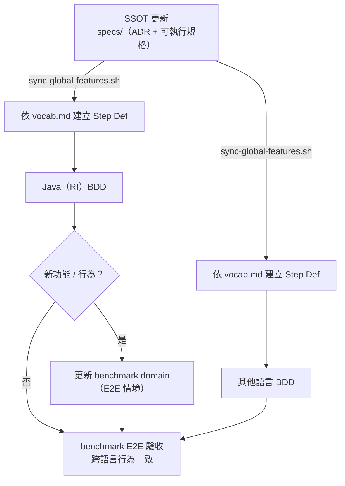

specformula-dev-framework 是一套 **ISA 框架**（Instruction Set Architecture）：用一份語言中立的規格描述宣告式 BDD 測試的指令與符號語義，讓同一份規格在多個語言實作上行為一致。

## 怎麼運作

SSOT 更新後 sync 到各語言，各語言建 Step Def、跑 BDD，最後在 benchmark 做跨語言 E2E 驗收：

**① SSOT 更新** — 改 `specs/`（ADR + `specs/features/` 可執行規格），`scripts/sync-global-features.sh <lang>` + terminology mapping 鏡射到各語言。

**② 各語言實作（RI 與其他語言相同）** — 依 `vocab.md` 建立 Step Def、跑 BDD 到綠（框架層一致性）。Java 是 Reference Implementation，先實作驗證規格可行。

**③ benchmark E2E 驗收** — benchmark 是專案的**跨語言 E2E 驗收情境**（真實 domain + target service）。RI 遇到新功能 / 行為時先更新對應 benchmark domain；接著 Java-For-All adapter 用同一份 domain spec 驅動各語言的 target service，全部過同一份驗收 → 跨語言行為一致。執行細節見 [Benchmark](/docs/contributing/benchmark)。

所以動手前先分清：你要改的是**規格定義的行為**（改 `specs/`）還是**某語言的實作**（改該語言）。實作與規格不一致時，預設是該語言實作的 bug；只有當規格本身有瑕疵或語意不清，才回頭改規格——任何單一語言（含 Java RI）的行為都不自動算標準。

## 模組地圖

| 模組 | 角色 |
|---|---|
| `specs/adr/` | 全域 ADR：跨語言規格與架構決策 |
| `specs/features/` | Feature SSOT、vocab、terminology mapping |
| `specformula-java/` | Reference Implementation（RI） |
| `specformula-{csharp,python,ts}/` | 其他語言實作；成熟度 / 同步狀態可能不同 |
| `benchmark/` | 跨實作驗收（domain + adapter）；主要變種測試 `todo_list`、`ecommerce_platform` |
| `specformula-docs/` | 文件站（你正在讀的就是這裡） |

## 先選你這次要改的東西

先判斷這次改動的主要目的，進對應入口；發現跨層再補讀其他頁。判斷核心：先找「誰定義 contract」。

<Cards>
  <Card title="Spec Author" href="/docs/contributing/spec-author">定義跨語言 contract：全域 ADR、feature、符號、指令、術語。動 `specs/`。</Card>
  <Card title="Implementer" href="/docs/contributing/implementer">在某語言落地既有規格、修 bug、寫專案 ADR。動 `specformula-{lang}/`。</Card>
  <Card title="Benchmark" href="/docs/contributing/benchmark">用真實 domain 驗證跨實作行為一致性。動 `benchmark/`。</Card>
  <Card title="Docs" href="/docs/contributing/docs/style-guide">寫 / 翻譯使用者與貢獻者文件。動 `specformula-docs/`。</Card>
</Cards>

跨多層的改動（規格 → RI → benchmark → 其他語言 → 文件）先讀 [貢獻流程 SOP](/docs/contributing/lifecycle)。

## 再深入

- SSOT 與驗證資產分層、新人閱讀順序：[SSOT 與驗證資產](/docs/contributing/overview/ssot)
- 術語定義：[詞彙表](/docs/contributing/overview/glossary)

## Quick links

- 行為準則：`CODE_OF_CONDUCT.md`（repo root，含 `.zh-TW.md`）
- 安全通報：`SECURITY.md`（請勿在公開 issue 揭露漏洞細節）
- 使用問題與 issue 路由：`SUPPORT.md`
