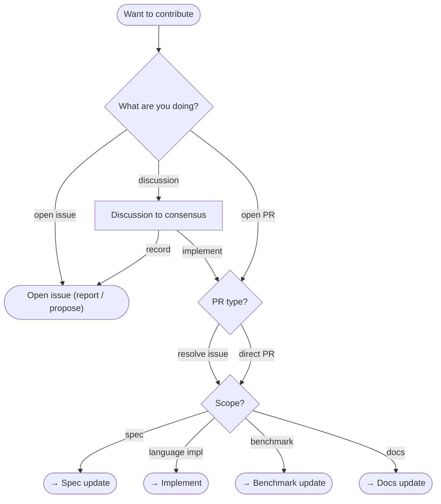
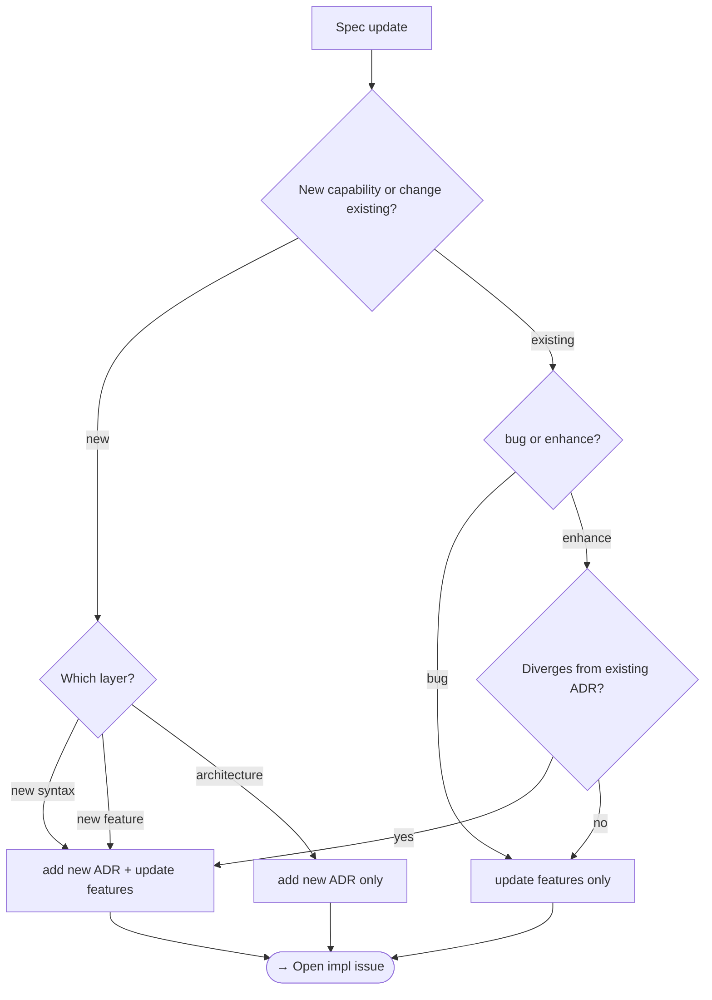
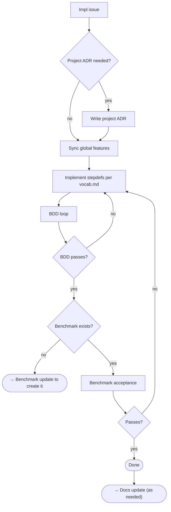
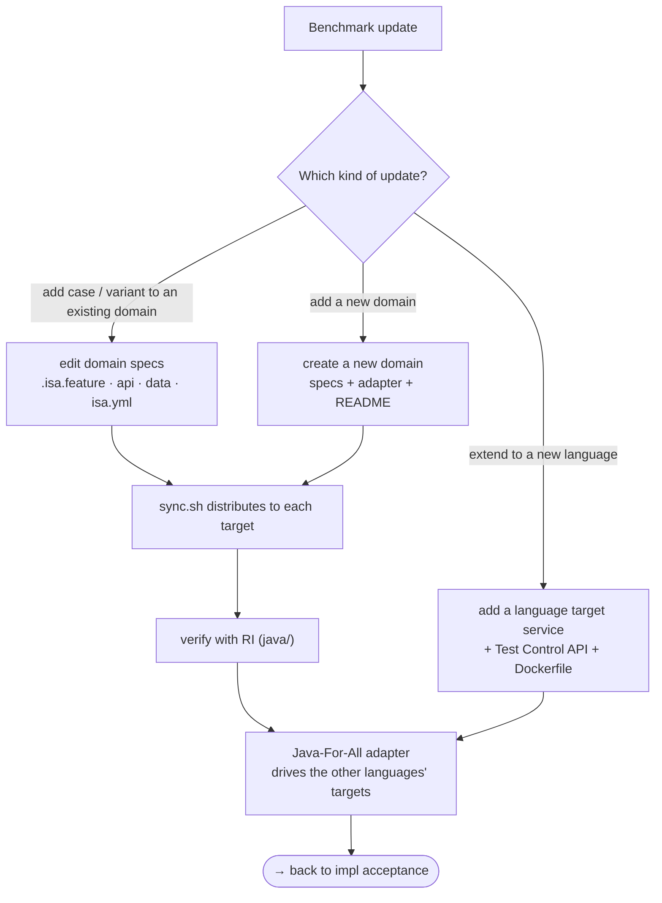
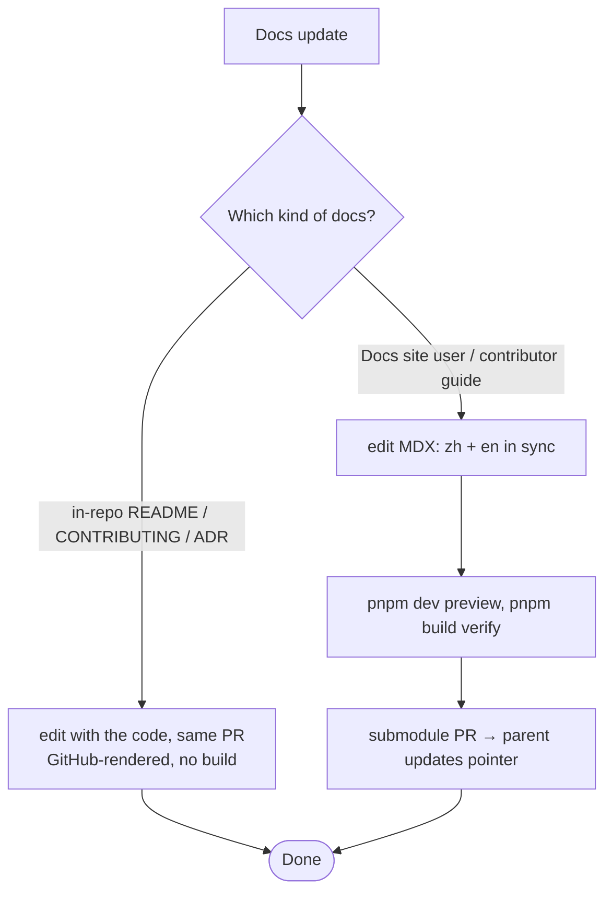

import { Tab } from 'fumadocs-ui/components/tabs';

Update the spec (SSOT) before implementing. Implementation and benchmark update are connected; once a feature is done, update docs as needed — docs can also be opened directly as an issue / PR from entry. Click a terminal node to jump tabs.

## The flows

<HashTabs items={["Entry", "Spec update", "Implement", "Benchmark update", "Docs update"]} hashes={["sop-entry", "sop-spec", "sop-impl", "sop-bench", "sop-docs"]}>

<Tab>

</Tab>

<Tab>

</Tab>

<Tab>

</Tab>

<Tab>

</Tab>

<Tab>

</Tab>

</HashTabs>

## SSOT

**SSOT = everything in `specs/`**, in two parts:

- **ADR** (decision records): `specs/adr/`
- **feature** (executable specs): `specs/features/`, containing `vocab.md` and terminology

A spec update is an SSOT update. Features must always stay consistent with ADRs; a global ADR is **immutable** and language-neutral (no implementation) — to revise a decision, add a new ADR that supersedes it.

## Further reading

- Writing specs: [spec-author](/docs/contributing/spec-author)
- Project ADRs: [implementer/writing-project-adr](/docs/contributing/implementer/writing-project-adr)
- Benchmark and adding a language target: [benchmark](/docs/contributing/benchmark), [benchmark/adding-language](/docs/contributing/benchmark/adding-language)
- RI is not the spec; cross-impl triage: [Reference Implementation](/docs/contributing/implementer), [implementer/cross-impl-policy](/docs/contributing/implementer/cross-impl-policy)
