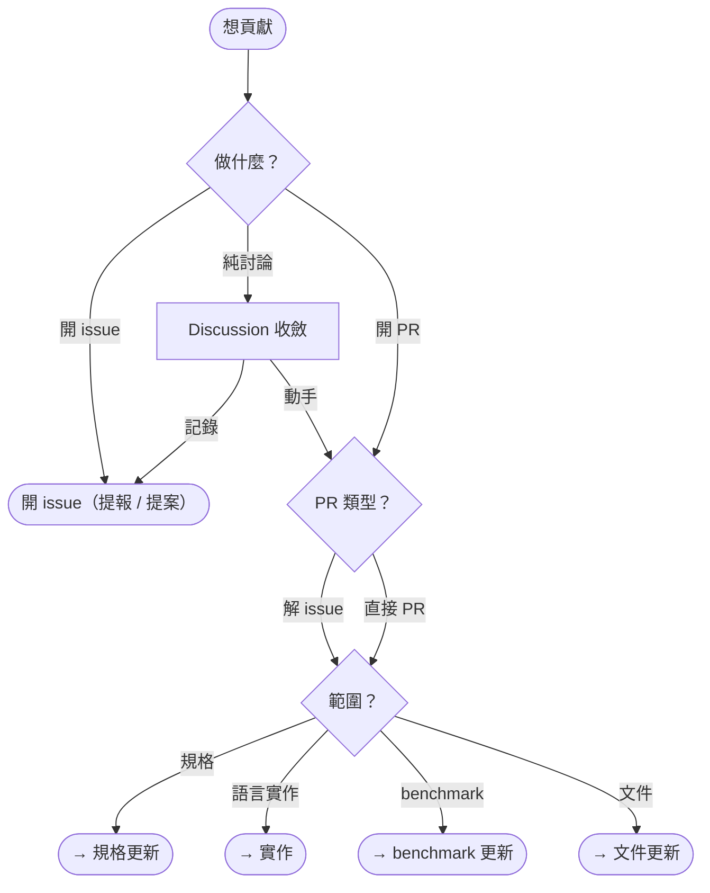
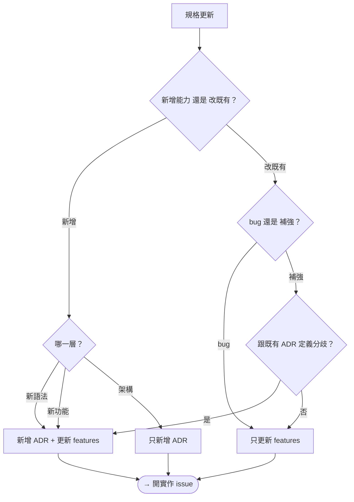
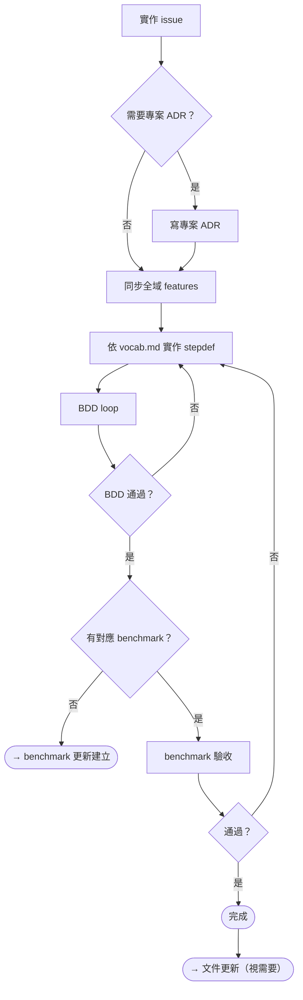
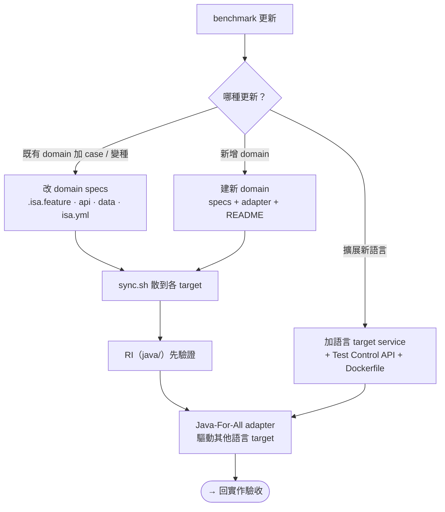
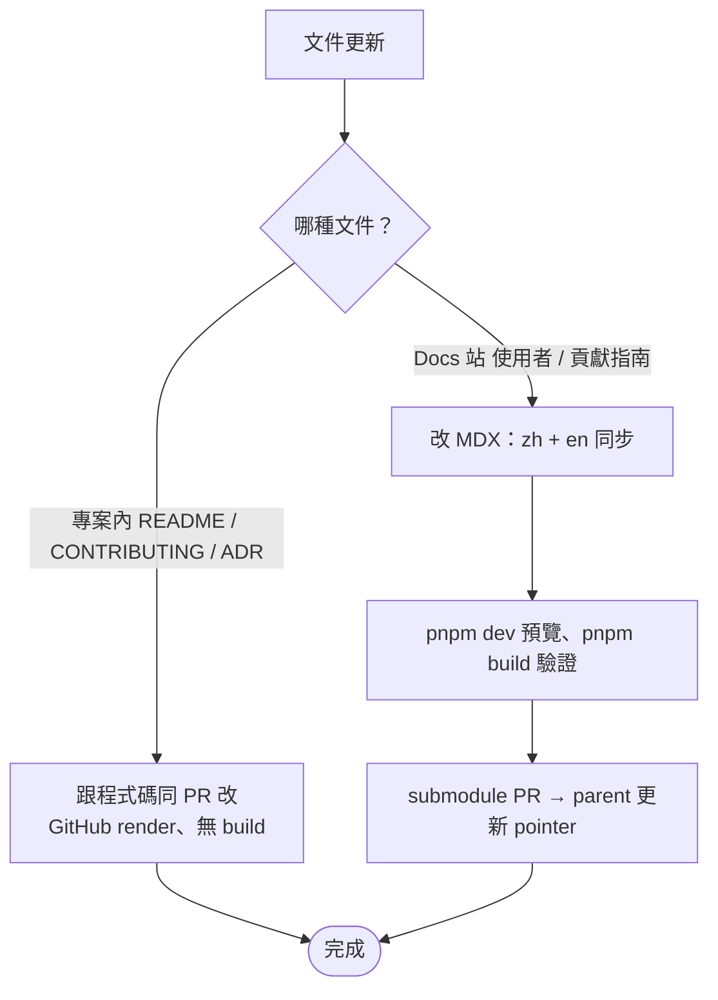

import { Tab } from 'fumadocs-ui/components/tabs';

動手前先更新規格（SSOT），再實作。實作與 benchmark 更新相接；功能完成後視需要更新文件，文件也可從進場直接開 issue / PR。尾端節點可點擊跳頁。

## 全流程

<HashTabs items={["進場", "規格更新", "實作", "benchmark 更新", "文件更新"]} hashes={["sop-entry", "sop-spec", "sop-impl", "sop-bench", "sop-docs"]}>

<Tab>

</Tab>

<Tab>

</Tab>

<Tab>

</Tab>

<Tab>

</Tab>

<Tab>

</Tab>

</HashTabs>

## SSOT

**SSOT = `specs/` 內所有文件**，分兩類：

- **ADR**（決策紀錄）：`specs/adr/`
- **feature**（可執行規格）：`specs/features/`，內含 `vocab.md` 與 terminology

規格更新就是更新 SSOT。feature 永遠要跟 ADR 一致；全域 ADR **不可變**、純語言中立（不含任何語言實作），要修訂就寫新 ADR 取代。

## 延伸閱讀

- 規格寫法：[spec-author](/docs/contributing/spec-author)
- 專案 ADR：[implementer/writing-project-adr](/docs/contributing/implementer/writing-project-adr)
- benchmark 與新增語言 target：[benchmark](/docs/contributing/benchmark)、[benchmark/adding-language](/docs/contributing/benchmark/adding-language)
- RI 不等於規格、跨實作分流：[Reference Implementation](/docs/contributing/implementer)、[implementer/cross-impl-policy](/docs/contributing/implementer/cross-impl-policy)
