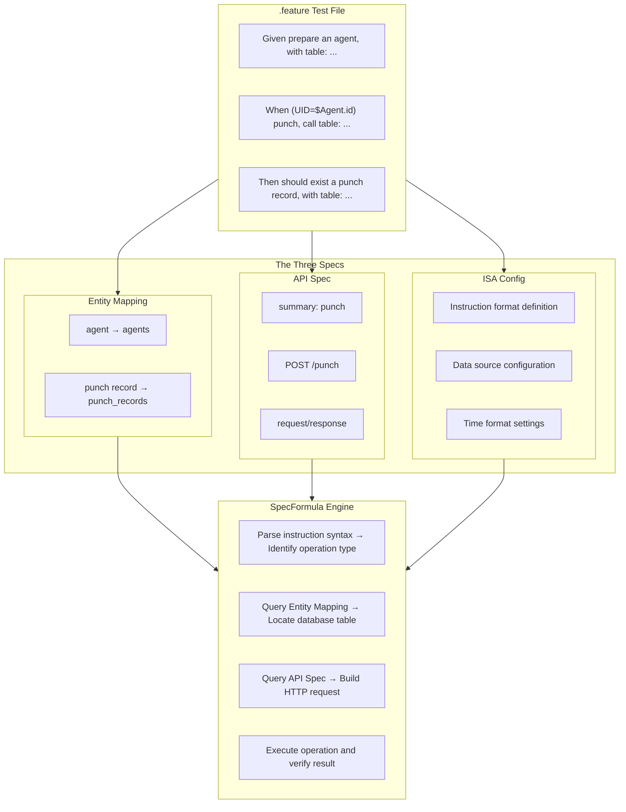

SpecFormula's backend testing framework is built on three core specification files, which we call "The Three Specs." These three specifications are interdependent and evolve together, forming the foundation of declarative BDD testing.

## Overview

| Spec | File | Purpose |
|------|------|---------|
| **API Spec** | `api-spec.yml` | Defines API endpoints, request/response structures (OpenAPI 3.0) |
| **Entity Mapping** | `entity_to_table_mapping.yml` | Defines the mapping between business entities and database tables |
| **ISA Config** | `isa.yml` | Defines instruction syntax and test environment configuration |



## Why Maintain Three Specs Together?

### 1. Single Source of Truth

In traditional BDD testing, API structure, database schema, and test code are maintained independently, which can easily lead to inconsistencies:

```
# Problems with traditional approach
API docs say: POST /users requires email field
Database has: users.email_address column
Test code: request.put("mail", value)  ← Inconsistent across all three
```

SpecFormula establishes a single source of truth through The Three Specs:

```yaml
# api-spec.yml defines API structure
paths:
  /users:
    post:
      summary: create user
      requestBody:
        properties:
          email:
            type: string

# entity_to_table_mapping.yml defines entity mapping
entity_to_table_mapping:
  - user: users

# Tests reference directly, no need to redefine
Given prepare a user, with table:
  | email             |
  | alice@example.com |
```

### 2. Cascading Changes

When an API changes, tests should automatically detect and prompt for updates:

```
API change: Rename /users to /members
            ↓
Entity Mapping may need update: user → members
            ↓
Verify if "create user" summary in test files maps correctly
```

SpecFormula's Lint feature checks the consistency of The Three Specs on changes, catching issues during the CI phase.

### 3. Spec-Driven Development

The Three Specs support a "spec first, implementation later" development workflow:

```
Phase 1: Product Manager defines API Spec
         ↓
Phase 2: DBA designs database tables, creates Entity Mapping
         ↓
Phase 3: QA writes .feature tests (tests will fail at this point)
         ↓
Phase 4: Developer implements features to make tests pass
```

This workflow ensures spec, implementation, and tests are aligned from the start.

---

## API Spec (OpenAPI 3.0)

### File Location

```
src/test/resources/specs/api/api-spec.yml
```

### Core Structure

```yaml
openapi: 3.0.0
info:
  title: My Application API
  version: 1.0.0

paths:
  /punch:
    post:
      summary: punch          # ← This is what ApiCall instruction uses to identify
      operationId: punch
      requestBody:
        required: true
        content:
          application/json:
            schema:
              type: object
              required:
                - agentId
                - punchType
              properties:
                agentId:
                  type: integer
                punchType:
                  type: string
                  enum: [IN, OUT]
                punchTime:
                  type: string
                  format: date-time
      responses:
        "200":
          description: Punch successful
          content:
            application/json:
              schema:
                type: object
                properties:
                  recordId:
                    type: integer
                  agentId:
                    type: integer
                  punchType:
                    type: string
                  punchTime:
                    type: string
                  dailyWorkHours:
                    type: number
```

### Mapping with ApiCall Instruction

```gherkin
When (UID="$Agent.id") punch, call table:
  | agentId      | punchType | punchTime              |
  | $Agent.id    | IN        | @time("2026-01-27T09:00:00") |
```

| Gherkin Element | API Spec Mapping |
|-----------------|------------------|
| `punch` | `paths./punch.post.summary` |
| `agentId`, `punchType`, `punchTime` | `requestBody.properties` |
| HTTP Method | `paths./punch.post` (inferred from path definition) |

### Important Rules

1. **summary must be unique**: Each operation's `summary` must be unique across the entire API Spec, otherwise SpecFormula cannot identify it
2. **Complete schema definition**: Request/Response schemas must be fully defined for Lint validation
3. **Correct required marking**: Required fields must be marked with `required`, Lint will check if tests provide them

---

## Entity Mapping

### File Location

```
src/test/resources/specs/data/entity_to_table_mapping.yml
```

### Core Structure

```yaml
entity_to_table_mapping:
  - agent: agents
  - punch record: punch_records
  - leave request: leave_requests
  - leave entitlement: leave_entitlements
  - overtime request: overtime_requests
```

### Mapping with EntitySetup/EntityValidate Instructions

```gherkin
Given prepare an agent, with table:
  | name    | email               |
  | Manager | manager@company.com |

Then should exist a punch record, with table:
  | agentId | punchType |
  | 1       | IN        |
```

| Gherkin Element | Entity Mapping |
|-----------------|----------------|
| `agent` | `agents` table |
| `punch record` | `punch_records` table |

### Column Name Conversion

DataTable uses camelCase, automatically mapped to database snake_case:

```
Gherkin: agentId    → DB: agent_id
Gherkin: punchType  → DB: punch_type
Gherkin: punchTime  → DB: punch_time
```

### Database Schema Source

SpecFormula reads database DDL or Schema definitions to validate column existence:

```
src/test/resources/specs/data/schema.sql   # H2
src/main/resources/db/migration/*.sql      # Flyway
```

---

## ISA Config

### File Location

```
src/test/resources/isa.yml
```

### Core Structure

```yaml
config:
  api:
    resource_path: specs/api              # API Spec relative path
    project_path: src/test/resources/specs/api
    time_format: timestamp                # Time format: ISO, timestamp, epoch
  data:
    source:
      - name: default
        resource_path: specs/data         # Entity Mapping relative path
        project_path: src/test/resources/specs/data
        db_type: h2                        # Database type

instructions:
  - name: Time control
    format: ^current time is "(?P<time>.+)"$
    instruction_type: time_control

  - name: API call
    format: ^\((?:No Actor|UID="(?P<userId>\$[\w.]+)")\) (?P<summary>.+?), call table:$
    instruction_type: api_call

  - name: Entity setup
    format: ^prepare a (?P<entity>[\w\s]+), with table:$
    instruction_type: entity_setup

  - name: Entity validation
    format: ^should exist a (?P<entity>[\w\s]+), with table:$
    instruction_type: entity_validate
```

### Configuration Details

| Config Item | Description |
|-------------|-------------|
| `config.api.resource_path` | API Spec classpath relative path |
| `config.api.time_format` | Serialization format for time fields in API requests |
| `config.data.source[].db_type` | Database type (h2, postgresql, mysql) |
| `instructions[].format` | Regular expression for instruction, used to match Gherkin steps |
| `instructions[].instruction_type` | Instruction type, determines execution logic |

---

## Iteration Workflow for The Three Specs

### Adding a New API Endpoint

```
1. Add path definition in api-spec.yml
2. If involving new entity, add mapping in entity_to_table_mapping.yml
3. Write .feature tests
4. Implement the API
5. Run tests to verify
```

### Modifying Database Structure

```
1. Update database Migration
2. If column name changes, check if .feature uses old column name
3. If entity name changes, update entity_to_table_mapping.yml
4. Run Lint to check consistency
5. Run tests to verify
```

### Changing API Behavior

```
1. Update request/response schema in api-spec.yml
2. Update expected results in related .feature tests
3. Modify API implementation
4. Run tests to verify
```

---

## Best Practices

### 1. Keep Summary Readable

```yaml
# ✅ Good summary: verb + noun, clearly describes the operation
summary: create user
summary: query order list
summary: update product inventory

# ❌ Avoid: too short or too technical
summary: create
summary: POST user
summary: updateInventoryById
```

### 2. Use Business Language for Entity Naming

```yaml
# ✅ Use names familiar to business team
entity_to_table_mapping:
  - member: members
  - order: orders
  - product: products

# ❌ Avoid technical names
entity_to_table_mapping:
  - member_entity: members
  - tbl_order: orders
```

### 3. Run Lint Checks Regularly

```bash
# Add Lint step in CI
mvn test -Dtest="SpecFormulaLintTest"
```

Lint checks:
- Whether summaries in API Spec are unique
- Whether tables in Entity Mapping exist
- Whether fields used in .feature are defined in Schema
