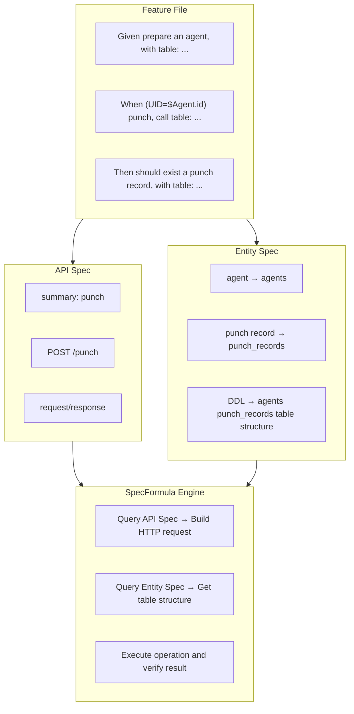

SpecFormula's backend testing framework is built on three core specifications, which we call "The Three Specs": **Feature** (`.feature` test files), **API Spec** (OpenAPI specifications), and **Entity Spec** (entity and table specifications). These three are interdependent and evolve together, forming the foundation of declarative BDD testing.

## Overview

| Spec | File | Purpose |
|------|------|---------|
| **Feature File** | `*.feature` | Defines test scenarios, references API Spec and Entity Spec |
| **API Spec** | `*.yml` (OpenAPI 3.0 format) | Defines API endpoints, request/response structures |
| **Entity Spec** | `entity_to_table_mapping.yml` + `*.sql` | Defines entity-to-table mapping and table structure (DDL) |



## Why Maintain Three Specs Together?

### 1. Single Source of Truth

In traditional BDD testing, API structure, database schema, and test code are maintained independently, which can easily lead to inconsistencies:

```
# Problems with traditional approach
API docs say: POST /users requires email field
Database has: users.email_address column
Test code: request.put("mail", value)  ← Inconsistent across all three
```

SpecFormula establishes a single source of truth through The Three Specs, with direct mapping between spec definitions and tests:

**Entity Spec** — Defines entity-to-table mapping and table structure

```yaml
# entity_to_table_mapping.yml
entity_to_table_mapping:
  - user: users
```

```sql
-- DDL (schema.sql)
CREATE TABLE users (user_id INT PRIMARY KEY, email VARCHAR(255) NOT NULL);
```

**API Spec** — Defines API structure

```yaml
# api-spec.yml
paths:
  /users:
    post:
      summary: create user
      requestBody:
        properties:
          email:
            type: string
```

**Tests directly reference specs, no need to redefine**

```gherkin
When (No Actor) create user, call table:       # ← Maps to API Spec (summary: create user)
  | email             |
  | alice@example.com |

Then should exist a user, with table:           # ← Maps to Entity Spec (user → users)
  | email             |
  | alice@example.com |
```

### 2. Cascading Changes

When specs change, Lint automatically checks the consistency of Feature, API Spec, and Entity Spec, catching issues during the CI phase:

**API Schema Change**

```
API Spec adds required field: requestBody.properties adds department (required)
            ↓
Lint checks .feature: whether all "create user" call tables include the department field
```

**Table Schema Change**

```
DDL column change: users table renames email to email_address
            ↓
Lint checks .feature: whether all "user" with tables use the correct column name
```

### 3. Spec-Driven Development

The Three Specs support a "spec first, implementation later" development workflow:

```
Phase 1: Product Manager defines API Spec
         ↓
Phase 2: DBA designs database tables, creates Entity Spec
         ↓
Phase 3: QA writes .feature tests (tests will fail at this point)
         ↓
Phase 4: Developer implements features to make tests pass
```

This workflow ensures spec, implementation, and tests are aligned from the start.

---

## API Spec (OpenAPI 3.0)

### File Location

API Spec can be split into multiple `.yml` files, as long as they follow OpenAPI 3.0 format. Path is specified by `config.api.resource_path` in `isa.yml`.

```
src/test/resources/specs/api/
├── api-spec.yml          # Can be split into multiple files
├── auth-api.yml          # e.g., split by module
└── ...
```

### Core Structure

```yaml
openapi: 3.0.0
info:
  title: My Application API
  version: 1.0.0

paths:
  /punch:
    post:
      summary: punch          # ← Identifier for ApiCall and ResponseValidate instructions
      operationId: punch
      requestBody:
        required: true
        content:
          application/json:
            schema:
              type: object
              required:
                - agentId
                - punchType
              properties:
                agentId:
                  type: integer
                punchType:
                  type: string
                  enum: [IN, OUT]
                punchTime:
                  type: string
                  format: date-time
      responses:
        "200":
          description: Punch successful
          content:
            application/json:
              schema:
                type: object
                properties:
                  recordId:
                    type: integer
                  agentId:
                    type: integer
                  punchType:
                    type: string
                  punchTime:
                    type: string
                  dailyWorkHours:
                    type: number
```

### Mapping with Feature Instructions

**ApiCall** — Identifies API endpoint via `summary`, sends HTTP request:

```gherkin
When (UID="$Agent.id") punch, call table:
  | agentId      | punchType | punchTime              |
  | $Agent.id    | IN        | @time("2026-01-27T09:00:00") |
```

**ResponseValidate** — Validates response content via `summary` and status code:

```gherkin
Then punch(200) response, with table:
  | recordId | agentId | punchType |
  | &isNotNull | 1       | IN        |
```

| Gherkin Element | API Spec Mapping |
|-----------------|------------------|
| `punch` | `paths./punch.post.summary` |
| `agentId`, `punchType`, `punchTime` | `requestBody.properties` |
| `recordId`, `punchType` etc. response fields | `responses.200.schema.properties` |
| HTTP Method | `paths./punch.post` (inferred from path definition) |

### Important Rules

1. **summary must be unique**: Each operation's `summary` must be unique across the entire API Spec, otherwise SpecFormula cannot identify it
2. **Complete schema definition**: Request/Response schemas must be fully defined for validation
3. **Correct required marking**: Required fields must be marked with `required`, ensuring tests provide all necessary fields

---

## Entity Spec

### File Location

Each Data Source directory contains:
- **`entity_to_table_mapping.yml`** — Defines entity name to table mapping
- **`*.sql` (DDL)** — Defines table structure (multiple files supported)

Path is specified by `config.data.source[].resource_path` in `isa.yml`.

```
src/test/resources/specs/data/
└── primary/
    ├── entity_to_table_mapping.yml   # Entity mapping
    ├── agents.sql                    # DDL (any filename, *.sql, multiple files supported)
    └── punch_records.sql
```

### Core Structure

**Entity Mapping** — Defines the mapping between business entity names and tables:

```yaml
# entity_to_table_mapping.yml
entity_to_table_mapping:
  - agent: agents
  - punch record: punch_records
```

**DDL** — Defines table schema, used by SpecFormula to validate column existence:

```sql
-- agents.sql
CREATE TABLE agents (
    agent_id INT PRIMARY KEY,
    name     VARCHAR(100) NOT NULL,
    email    VARCHAR(255) NOT NULL
);

-- punch_records.sql
CREATE TABLE punch_records (
    record_id  INT PRIMARY KEY,
    agent_id   INT NOT NULL,
    punch_type VARCHAR(10),
    punch_time DATETIME
);
```

### Mapping with EntitySetup/EntityValidate Instructions

```gherkin
Given prepare an agent, with table:
  | name    | email               |
  | Manager | manager@company.com |

Then should exist a punch record, with table:
  | agentId | punchType |
  | 1       | IN        |
```

| Gherkin Element | Entity Mapping |
|-----------------|----------------|
| `agent` | `agents` table |
| `punch record` | `punch_records` table |

### Column Name Conversion

DataTable uses camelCase, automatically mapped to database snake_case:

```
Gherkin: agentId    → DB: agent_id
Gherkin: punchType  → DB: punch_type
Gherkin: punchTime  → DB: punch_time
```

---

## ISA Config (Configuration)

ISA Config is the configuration file for the SpecFormula engine, defining instruction syntax and spec file paths. It is typically set up once at the beginning of a project and rarely needs to change.

### File Location

```
src/test/resources/isa.yml
```

### Core Structure

```yaml
config:
  api:
    resource_path: specs/api                          # classpath, used by framework at runtime
    project_path: src/test/resources/specs/api        # source path, used by Lint for error reporting
  data:
    source:
      - name: primary
        resource_path: specs/data/primary             # classpath, used by framework at runtime
        project_path: src/test/resources/specs/data/primary  # source path, used by Lint for error reporting
        db_type: mssql

instructions:
  - name: Time control
    format: ^current time is "(?P<time>[^"]+)"$
    instruction_type: time_control

  - name: Data preparation
    format: ^prepare a (?P<entity>[\w\s]+), with table:$
    instruction_type: entity_setup

  - name: API call
    format: ^\((?:No Actor|UID="(?P<userId>\$[\w.]+)")\) (?P<summary>.+?), call table:$
    instruction_type: api_call

  - name: Response validation with API summary and status code
    format: ^(?P<summary>.+?)\((?P<status_code>\d{3})\) response,?\s*with table:$
    instruction_type: response_validate
    data_format: data_table

  - name: Database validation
    format: ^should exist a (?P<entity>[\w\s]+), with table:$
    instruction_type: entity_validate

  - name: Database non-existence validation
    format: ^should not exist a (?P<entity>[\w\s]+), with table:$
    instruction_type: entity_non_existence_validate
```

### Configuration Details

| Config Item | Description |
|-------------|-------------|
| `config.api.resource_path` | API Spec classpath relative path |
| `config.data.source[]` | Multiple Data Sources supported, each pointing to a set of Entity Spec |
| `config.data.source[].db_type` | Database type (h2, mssql, postgresql, mysql) |
| `instructions[].format` | Regular expression for instruction, used to match Gherkin steps |
| `instructions[].instruction_type` | Instruction type, determines execution logic |

---

## Iteration Workflow for The Three Specs

### Adding a New API Endpoint

```
1. Add path definition in API Spec
2. Write .feature tests
3. Implement the API
4. Run tests to verify
```

### Modifying Table Structure

```
1. Update DDL (*.sql)
2. If table name changes, update entity_to_table_mapping.yml mapping
3. If column name changes, update column names in .feature files
4. Run Lint to check consistency
5. Run tests to verify
```

### Changing API Behavior

```
1. Update request/response schema in api-spec.yml
2. Update expected results in related .feature tests
3. Modify API implementation
4. Run tests to verify
```

---

## Best Practices

### 1. Keep Summary Readable

```yaml
# ✅ Good summary: verb + noun, clearly describes the operation
summary: create user
summary: query order list
summary: update product inventory

# ❌ Avoid: too short or too technical
summary: create
summary: POST user
summary: updateInventoryById
```

### 2. Use Business Language for Entity Naming

```yaml
# ✅ Use names familiar to business team
entity_to_table_mapping:
  - member: members
  - order: orders
  - product: products

# ❌ Avoid technical names
entity_to_table_mapping:
  - member_entity: members
  - tbl_order: orders
```

### 3. Run Lint Checks Regularly

```bash
# Add Lint step in CI
# TODO: Command to be added
```

Lint checks:
- Whether summaries in API Spec are unique
- Whether tables in Entity Spec `entity_to_table_mapping` exist in DDL
- Whether fields used in Feature File are defined in Entity Spec and API Spec

### 4. CI Automated Testing

Integrate tests into CI pipeline to ensure every commit automatically validates The Three Specs consistency.

**Java (Maven)**

```bash
mvn test
```
