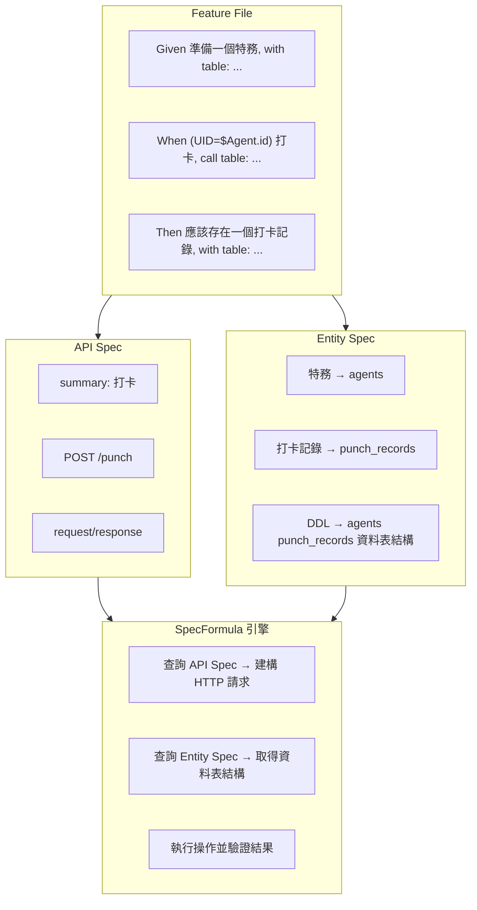

SpecFormula 的後端測試框架建立在三份核心規格文件之上，我們稱之為「規格三巨頭」。這三份規格相互依賴、共同演進，構成了宣告式 BDD 測試的基礎。

## 三巨頭概覽

| 規格 | 檔案 | 用途 |
|------|------|------|
| **Feature File** | `*.feature` | 定義測試場景，引用 API Spec 與 Entity Spec |
| **API Spec** | `*.yml`（OpenAPI 3.0 格式） | 定義 API 端點、請求/回應結構 |
| **Entity Spec** | `entity_to_table_mapping.yml` + `*.sql` | 定義實體名稱與資料表的關聯，以及資料表結構（DDL） |



## 為什麼要三份規格一起維護？

### 1. 單一事實來源 (Single Source of Truth)

傳統 BDD 測試中，API 結構、資料庫 Schema、測試程式碼各自獨立維護，容易產生不一致：

```
# 傳統做法的問題
API 文件說：POST /users 需要 email 欄位
資料庫有：users.email_address 欄位
測試程式：request.put("mail", value)  ← 三方各自維護，容易不一致
```

SpecFormula 透過三巨頭建立單一事實來源，規格定義與測試直接對應：

**Entity Spec** — 定義實體與資料表的關聯及結構

```yaml
# entity_to_table_mapping.yml
entity_to_table_mapping:
  - 使用者: users
```

```sql
-- DDL (schema.sql)
CREATE TABLE users (user_id INT PRIMARY KEY, email VARCHAR(255) NOT NULL);
```

**API Spec** — 定義 API 結構

```yaml
# api-spec.yml
paths:
  /users:
    post:
      summary: 建立使用者
      requestBody:
        properties:
          email:
            type: string
```

**測試直接引用規格，無需重複定義**

```gherkin
When (No Actor) 建立使用者, call table:       # ← 對應 API Spec（summary: 建立使用者）
  | email             |
  | alice@example.com |

Then 應該存在一個使用者, with table:           # ← 對應 Entity Spec（使用者 → users）
  | email             |
  | alice@example.com |
```

### 2. 連動變更 (Cascading Changes)

當規格變更時，Lint 會自動檢查 Feature、API Spec、Entity Spec 三者的一致性，在 CI 階段就能發現問題：

**API Schema 變更**

```
API Spec 新增必填欄位：requestBody.properties 加入 department (required)
            ↓
Lint 檢查 .feature：所有「建立使用者」的 call table 是否包含 department 欄位
```

**Table Schema 變更**

```
DDL 欄位異動：users 資料表將 email 改為 email_address
            ↓
Lint 檢查 .feature：所有「使用者」的 with table 是否使用正確的欄位名稱
```

### 3. 規格驅動開發 (Spec-Driven Development)

三巨頭支援「先寫規格、後寫實作」的開發流程：

```
Phase 1: 產品經理定義 API Spec
         ↓
Phase 2: DBA 設計資料表，建立 Entity Spec
         ↓
Phase 3: QA 撰寫 .feature 測試（此時測試會失敗）
         ↓
Phase 4: 開發者實作功能，讓測試通過
```

這種流程確保規格、實作、測試三者從一開始就對齊。

---

## API Spec (OpenAPI 3.0)

### 檔案位置

API Spec 可拆分為多個 `.yml` 檔案，只要符合 OpenAPI 3.0 格式即可。路徑由 `isa.yml` 的 `config.api.resource_path` 指定。

```
src/test/resources/specs/api/
├── api-spec.yml          # 可拆分為多個檔案
├── auth-api.yml          # 例如依模組拆分
└── ...
```

### 核心結構

```yaml
openapi: 3.0.0
info:
  title: 我的應用程式 API
  version: 1.0.0

paths:
  /punch:
    post:
      summary: 打卡          # ← ApiCall 與 ResponseValidate 指令的識別依據
      operationId: punch
      requestBody:
        required: true
        content:
          application/json:
            schema:
              type: object
              required:
                - agentId
                - punchType
              properties:
                agentId:
                  type: integer
                punchType:
                  type: string
                  enum: [IN, OUT]
                punchTime:
                  type: string
                  format: date-time
      responses:
        "200":
          description: 打卡成功
          content:
            application/json:
              schema:
                type: object
                properties:
                  recordId:
                    type: integer
                  agentId:
                    type: integer
                  punchType:
                    type: string
                  punchTime:
                    type: string
                  dailyWorkHours:
                    type: number
```

### 與 Feature 指令的對應

**ApiCall** — 透過 `summary` 識別 API 端點，發送 HTTP 請求：

```gherkin
When (UID="$Agent.id") 打卡, call table:
  | agentId      | punchType | punchTime              |
  | $Agent.id    | IN        | @time("2026-01-27T09:00:00") |
```

**ResponseValidate** — 透過 `summary` 與 status code 驗證回應內容：

```gherkin
Then 打卡(200)回應, with table:
  | recordId | agentId | punchType |
  | &isNotNull | 1       | IN        |
```

| Gherkin 元素 | 對應 API Spec |
|-------------|---------------|
| `打卡` | `paths./punch.post.summary` |
| `agentId`, `punchType`, `punchTime` | `requestBody.properties` |
| `recordId`, `punchType` 等回應欄位 | `responses.200.schema.properties` |
| HTTP Method | `paths./punch.post`（從 path 定義推斷） |

### 重要規則

1. **summary 必須唯一**：每個操作的 `summary` 在整份 API Spec 中必須唯一，否則 SpecFormula 無法識別
2. **Schema 定義完整**：Request/Response 的 Schema 需完整定義，用於驗證
3. **required 標記正確**：必填欄位需標記 `required`，確保測試提供所有必要欄位

---

## Entity Spec

### 檔案位置

每個 Data Source 目錄下包含：
- **`entity_to_table_mapping.yml`** — 定義實體名稱與資料表的關聯
- **`*.sql`（DDL）** — 定義資料表結構（可多檔）

路徑由 `isa.yml` 的 `config.data.source[].resource_path` 指定。

```
src/test/resources/specs/data/
└── primary/
    ├── entity_to_table_mapping.yml   # 實體對應
    ├── agents.sql                    # DDL（檔名不限，*.sql 皆可，可多檔）
    └── punch_records.sql
```

### 核心結構

**Entity Mapping** — 定義業務實體名稱與資料表的對應：

```yaml
# entity_to_table_mapping.yml
entity_to_table_mapping:
  - 特務: agents
  - 打卡記錄: punch_records
```

**DDL** — 定義資料表的 Schema，SpecFormula 用來驗證欄位是否存在：

```sql
-- agents.sql
CREATE TABLE agents (
    agent_id INT PRIMARY KEY,
    name     VARCHAR(100) NOT NULL,
    email    VARCHAR(255) NOT NULL
);

-- punch_records.sql
CREATE TABLE punch_records (
    record_id  INT PRIMARY KEY,
    agent_id   INT NOT NULL,
    punch_type VARCHAR(10),
    punch_time DATETIME
);
```

### 與 EntitySetup/EntityValidate 指令的對應

```gherkin
Given 準備一個特務, with table:
  | name    | email               |
  | Manager | manager@company.com |

Then 應該存在一個打卡記錄, with table:
  | agentId | punchType |
  | 1       | IN        |
```

| Gherkin 元素 | 對應 Entity Mapping |
|-------------|---------------------|
| `特務` | `agents` 資料表 |
| `打卡記錄` | `punch_records` 資料表 |

### 欄位名稱轉換

DataTable 使用 camelCase，自動對應資料庫的 snake_case：

```
Gherkin: agentId    → DB: agent_id
Gherkin: punchType  → DB: punch_type
Gherkin: punchTime  → DB: punch_time
```

在實際比對資料庫欄位時，框架會對每一個欄位名稱套用三層匹配邏輯：

- **第一層：精確匹配**
  - 先用原始欄位名稱直接找，例如 `agentId` 對 `agentId`。
- **第二層：camelCase → snake_case**
  - 若找不到精確匹配，會將 `agentId` 轉成 `agent_id`，再嘗試匹配 DDL / 實際資料的欄位名稱。
- **第三層：忽略大小寫**
  - 若前兩層都沒找到，最後會以「忽略大小寫」的方式比對，例如 `agent_id`、`AGENT_ID`、`Agent_Id` 都會被視為同一個欄位。

以下是幾種常見組合的行為（左邊是 Feature／DataTable 欄位，右邊是 DDL／實際 Map 的 key）：

| Feature 欄位名稱 | DDL / Map 欄位名稱 | 是否匹配 | 說明 |
|------------------|--------------------|----------|------|
| `agentId`        | `agentId`          | ✅ 是 | 第一層：直接 `equals` 匹配 |
| `agentId`        | `agent_id`         | ✅ 是 | 第二層：camelCase → snake_case |
| `agentId`        | `AGENT_ID`         | ✅ 是 | 第二層轉成 `agent_id` 後，再第三層 `equalsIgnoreCase` 匹配 |

因此只要在 Spec／Gherkin 中統一使用 camelCase，就能穩定對應到 DDL 中常見的 snake_case 或全大寫命名，而不需要在測試或程式碼中手動處理大小寫與底線差異。

---

## ISA Config（配置檔）

ISA Config 是 SpecFormula 引擎的配置檔，定義指令語法與規格檔案路徑。通常在專案初期設定完成後，不需頻繁變動。

### 檔案位置

```
src/test/resources/isa.yml
```

### 核心結構

```yaml
config:
  api:
    resource_path: specs/api                          # classpath 路徑，框架讀取用
    project_path: src/test/resources/specs/api        # 原始碼路徑，Lint 報錯用
  data:
    source:
      - name: primary
        resource_path: specs/data/primary             # classpath 路徑，框架讀取用
        project_path: src/test/resources/specs/data/primary  # 原始碼路徑，Lint 報錯用
        db_type: mssql

instructions:
  - name: Time control
    format: ^現在時間為 "(?P<time>[^"]+)"$
    instruction_type: time_control

  - name: Data preparation
    format: ^準備一個(?P<entity>[\u4e00-\u9fffa-zA-Z0-9_]+), with table:$
    instruction_type: entity_setup

  - name: API call
    format: ^\((?:No Actor|UID="(?P<userId>\$[\w.]+)")\) (?P<summary>.+?), call table:$
    instruction_type: api_call

  - name: Response validation with API summary and status code
    format: ^(?P<summary>.+?)\((?P<status_code>\d{3})\)回應,?\s*with table:$
    instruction_type: response_validate
    data_format: data_table

  - name: Database validation
    format: ^應該存在一個(?P<entity>[\u4e00-\u9fffa-zA-Z0-9_]+), with table:$
    instruction_type: entity_validate

  - name: Database non-existence validation
    format: ^應該不存在一個(?P<entity>[\u4e00-\u9fffa-zA-Z0-9_]+), with table:$
    instruction_type: entity_non_existence_validate
```

### 配置說明

| 配置項 | 說明 |
|--------|------|
| `config.api.resource_path` | API Spec 的 classpath 相對路徑 |
| `config.data.source[]` | 可配置多個 Data Source，每個各自指向一組 Entity Spec |
| `config.data.source[].db_type` | 資料庫類型（h2, mssql, postgresql, mysql） |
| `instructions[].format` | 指令的正規表達式，用於匹配 Gherkin 步驟 |
| `instructions[].instruction_type` | 指令類型，決定執行邏輯 |

---

## 三巨頭的迭代流程

### 新增 API 端點

```
1. 在 API Spec 新增 path 定義
2. 撰寫 .feature 測試
3. 實作 API
4. 執行測試驗證
```

### 修改資料表結構

```
1. 更新 DDL（*.sql）
2. 若資料表名稱變更，更新 entity_to_table_mapping.yml 的對應
3. 若欄位名稱變更，更新 .feature 中的欄位名稱
4. 執行 Lint 檢查一致性
5. 執行測試驗證
```

### 變更 API 行為

```
1. 更新 api-spec.yml 中的 request/response schema
2. 更新相關 .feature 測試的預期結果
3. 修改 API 實作
4. 執行測試驗證
```

---

## 最佳實踐

### 1. 保持 Summary 可讀

```yaml
# ✅ 好的 summary：動詞 + 名詞，清楚描述操作
summary: 建立使用者
summary: 查詢訂單列表
summary: 更新商品庫存

# ❌ 避免的 summary：太短或太技術性
summary: create
summary: POST user
summary: updateInventoryById
```

### 2. Entity 命名使用業務語言

```yaml
# ✅ 使用業務團隊熟悉的名稱
entity_to_table_mapping:
  - 會員: members
  - 訂單: orders
  - 商品: products

# ❌ 避免使用技術名稱
entity_to_table_mapping:
  - member_entity: members
  - tbl_order: orders
```

### 3. 定期執行 Lint 檢查

```bash
# 在 CI 中加入 Lint 步驟
# TODO: 指令待補充
```

Lint 會檢查：
- API Spec 中的 summary 是否唯一
- Entity Spec 中 `entity_to_table_mapping` 的資料表是否存在於 DDL
- Feature File 中使用的欄位是否在 Entity Spec 與 API Spec 中定義

### 4. CI 自動化測試

將測試整合至 CI pipeline，確保每次提交都自動驗證三巨頭的一致性。

**Java (Maven)**

```bash
mvn test
```
