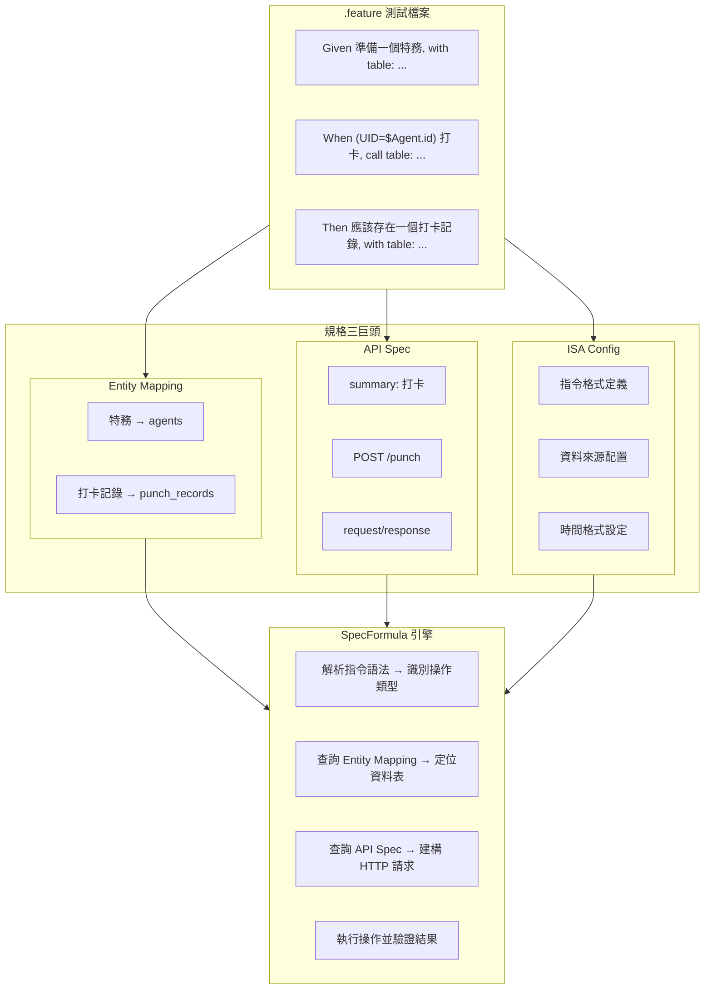

SpecFormula 的後端測試框架建立在三份核心規格文件之上，我們稱之為「規格三巨頭」。這三份規格相互依賴、共同演進，構成了宣告式 BDD 測試的基礎。

## 三巨頭概覽

| 規格 | 檔案 | 用途 |
|------|------|------|
| **API Spec** | `api-spec.yml` | 定義 API 端點、請求/回應結構（OpenAPI 3.0） |
| **Entity Mapping** | `entity_to_table_mapping.yml` | 定義業務實體與資料表的對應關係 |
| **ISA Config** | `isa.yml` | 定義指令語法與測試環境配置 |



## 為什麼要三份規格一起維護？

### 1. 單一事實來源 (Single Source of Truth)

傳統 BDD 測試中，API 結構、資料庫 Schema、測試程式碼各自獨立維護，容易產生不一致：

```
# 傳統做法的問題
API 文件說：POST /users 需要 email 欄位
資料庫有：users.email_address 欄位
測試程式：request.put("mail", value)  ← 三方不一致
```

SpecFormula 透過三巨頭建立單一事實來源：

```yaml
# api-spec.yml 定義 API 結構
paths:
  /users:
    post:
      summary: 建立使用者
      requestBody:
        properties:
          email:
            type: string

# entity_to_table_mapping.yml 定義實體對應
entity_to_table_mapping:
  - 使用者: users

# 測試直接引用，無需重複定義
Given 準備一個使用者, with table:
  | email             |
  | alice@example.com |
```

### 2. 連動變更 (Cascading Changes)

當 API 變更時，測試應該自動感知並提示需要更新：

```
API 變更：將 /users 改為 /members
            ↓
Entity Mapping 可能需要更新：使用者 → members
            ↓
測試檔案中的「建立使用者」summary 需確認是否對應正確
```

SpecFormula 的 Lint 功能會在變更時檢查三巨頭的一致性，在 CI 階段就能發現問題。

### 3. 規格驅動開發 (Spec-Driven Development)

三巨頭支援「先寫規格、後寫實作」的開發流程：

```
Phase 1: 產品經理定義 API Spec
         ↓
Phase 2: DBA 設計資料表，建立 Entity Mapping
         ↓
Phase 3: QA 撰寫 .feature 測試（此時測試會失敗）
         ↓
Phase 4: 開發者實作功能，讓測試通過
```

這種流程確保規格、實作、測試三者從一開始就對齊。

---

## API Spec (OpenAPI 3.0)

### 檔案位置

```
src/test/resources/specs/api/api-spec.yml
```

### 核心結構

```yaml
openapi: 3.0.0
info:
  title: 我的應用程式 API
  version: 1.0.0

paths:
  /punch:
    post:
      summary: 打卡          # ← 這是 ApiCall 指令的識別依據
      operationId: punch
      requestBody:
        required: true
        content:
          application/json:
            schema:
              type: object
              required:
                - agentId
                - punchType
              properties:
                agentId:
                  type: integer
                punchType:
                  type: string
                  enum: [IN, OUT]
                punchTime:
                  type: string
                  format: date-time
      responses:
        "200":
          description: 打卡成功
          content:
            application/json:
              schema:
                type: object
                properties:
                  recordId:
                    type: integer
                  agentId:
                    type: integer
                  punchType:
                    type: string
                  punchTime:
                    type: string
                  dailyWorkHours:
                    type: number
```

### 與 ApiCall 指令的對應

```gherkin
When (UID="$Agent.id") 打卡, call table:
  | agentId      | punchType | punchTime              |
  | $Agent.id    | IN        | @time("2026-01-27T09:00:00") |
```

| Gherkin 元素 | 對應 API Spec |
|-------------|---------------|
| `打卡` | `paths./punch.post.summary` |
| `agentId`, `punchType`, `punchTime` | `requestBody.properties` |
| HTTP Method | `paths./punch.post` (從 path 定義推斷) |

### 重要規則

1. **summary 必須唯一**：每個操作的 `summary` 在整份 API Spec 中必須唯一，否則 SpecFormula 無法識別
2. **Schema 定義完整**：Request/Response 的 Schema 需完整定義，用於 Lint 驗證
3. **required 標記正確**：必填欄位需標記 `required`，Lint 會檢查測試是否提供

---

## Entity Mapping

### 檔案位置

```
src/test/resources/specs/data/entity_to_table_mapping.yml
```

### 核心結構

```yaml
entity_to_table_mapping:
  - 特務: agents
  - 打卡記錄: punch_records
  - 請假申請: leave_requests
  - 假期額度: leave_entitlements
  - 加班申請: overtime_requests
```

### 與 EntitySetup/EntityValidate 指令的對應

```gherkin
Given 準備一個特務, with table:
  | name    | email               |
  | Manager | manager@company.com |

Then 應該存在一個打卡記錄, with table:
  | agentId | punchType |
  | 1       | IN        |
```

| Gherkin 元素 | 對應 Entity Mapping |
|-------------|---------------------|
| `特務` | `agents` 資料表 |
| `打卡記錄` | `punch_records` 資料表 |

### 欄位名稱轉換

DataTable 使用 camelCase，自動對應資料庫的 snake_case：

```
Gherkin: agentId    → DB: agent_id
Gherkin: punchType  → DB: punch_type
Gherkin: punchTime  → DB: punch_time
```

### 資料表 Schema 來源

SpecFormula 會讀取資料庫的 DDL 或 Schema 定義來驗證欄位是否存在：

```
src/test/resources/specs/data/schema.sql   # H2
src/main/resources/db/migration/*.sql      # Flyway
```

---

## ISA Config

### 檔案位置

```
src/test/resources/isa.yml
```

### 核心結構

```yaml
config:
  api:
    resource_path: specs/api              # API Spec 相對路徑
    project_path: src/test/resources/specs/api
    time_format: timestamp                # 時間格式：ISO, timestamp, epoch
  data:
    source:
      - name: default
        resource_path: specs/data         # Entity Mapping 相對路徑
        project_path: src/test/resources/specs/data
        db_type: h2                        # 資料庫類型

instructions:
  - name: Time control
    format: ^現在的時間是 "(?P<time>.+)"$
    instruction_type: time_control

  - name: API call
    format: ^\((?:No Actor|UID="(?P<userId>\$[\w.]+)")\) (?P<summary>.+?), call table:$
    instruction_type: api_call

  - name: Entity setup
    format: ^準備一個(?P<entity>[\u4e00-\u9fffa-zA-Z0-9_]+), with table:$
    instruction_type: entity_setup

  - name: Entity validation
    format: ^應該存在一個(?P<entity>[\u4e00-\u9fffa-zA-Z0-9_]+), with table:$
    instruction_type: entity_validate
```

### 配置說明

| 配置項 | 說明 |
|--------|------|
| `config.api.resource_path` | API Spec 的 classpath 相對路徑 |
| `config.api.time_format` | API 請求中時間欄位的序列化格式 |
| `config.data.source[].db_type` | 資料庫類型（h2, postgresql, mysql） |
| `instructions[].format` | 指令的正規表達式，用於匹配 Gherkin 步驟 |
| `instructions[].instruction_type` | 指令類型，決定執行邏輯 |

---

## 三巨頭的迭代流程

### 新增 API 端點

```
1. 在 api-spec.yml 新增 path 定義
2. 若涉及新實體，在 entity_to_table_mapping.yml 新增對應
3. 撰寫 .feature 測試
4. 實作 API
5. 執行測試驗證
```

### 修改資料表結構

```
1. 更新資料庫 Migration
2. 若欄位名稱變更，檢查 .feature 中是否使用舊欄位名
3. 若實體名稱變更，更新 entity_to_table_mapping.yml
4. 執行 Lint 檢查一致性
5. 執行測試驗證
```

### 變更 API 行為

```
1. 更新 api-spec.yml 中的 request/response schema
2. 更新相關 .feature 測試的預期結果
3. 修改 API 實作
4. 執行測試驗證
```

---

## 最佳實踐

### 1. 保持 Summary 可讀

```yaml
# ✅ 好的 summary：動詞 + 名詞，清楚描述操作
summary: 建立使用者
summary: 查詢訂單列表
summary: 更新商品庫存

# ❌ 避免的 summary：太短或太技術性
summary: create
summary: POST user
summary: updateInventoryById
```

### 2. Entity 命名使用業務語言

```yaml
# ✅ 使用業務團隊熟悉的名稱
entity_to_table_mapping:
  - 會員: members
  - 訂單: orders
  - 商品: products

# ❌ 避免使用技術名稱
entity_to_table_mapping:
  - member_entity: members
  - tbl_order: orders
```

### 3. 定期執行 Lint 檢查

```bash
# 在 CI 中加入 Lint 步驟
mvn test -Dtest="SpecFormulaLintTest"
```

Lint 會檢查：
- API Spec 中的 summary 是否唯一
- Entity Mapping 中的資料表是否存在
- .feature 中使用的欄位是否在 Schema 中定義
